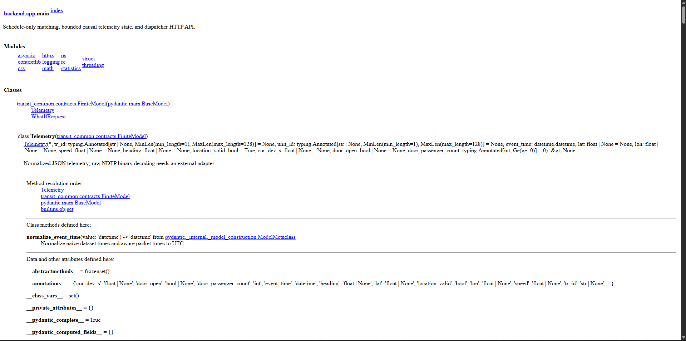
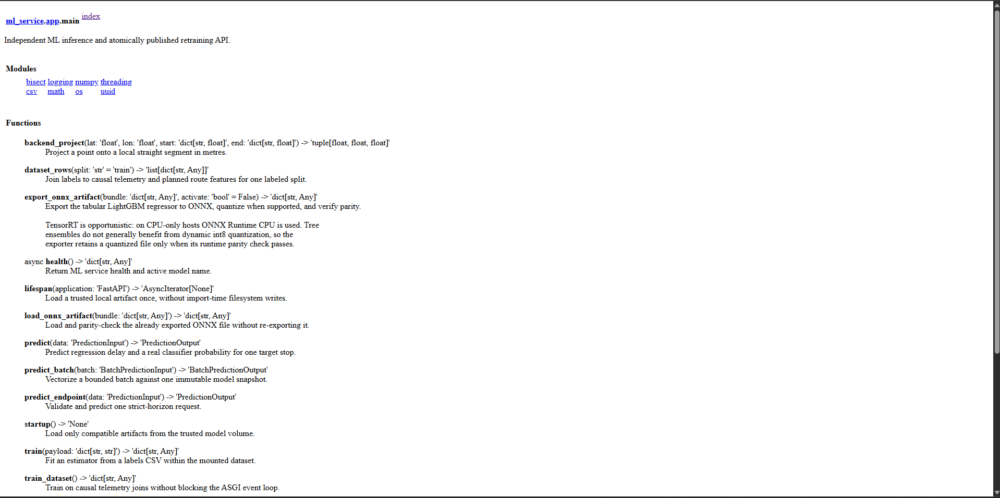
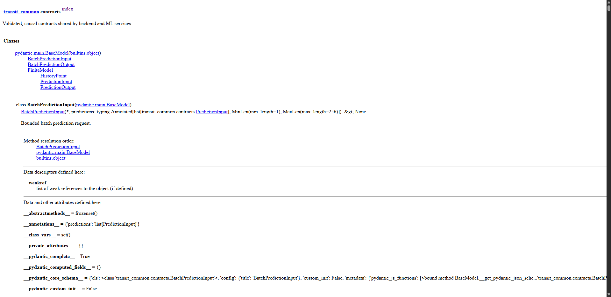
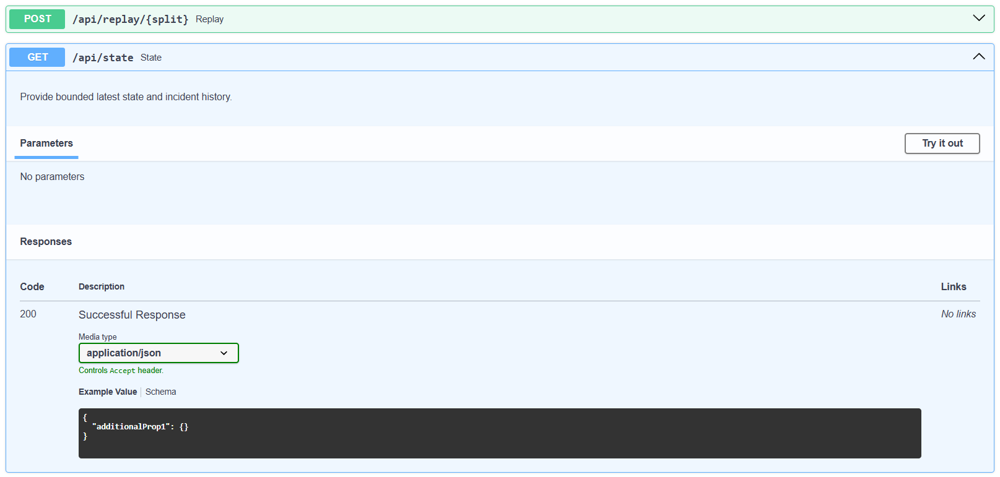

# Документация к коду и API

Документ описывает структуру исходного кода, сгенерированную документацию PyDoc
и интерактивные OpenAPI/Swagger-схемы Backend и ML-сервиса.

## Структура проекта

| Путь | Назначение |
|---|---|
| `backend/app/main.py` | Backend API, NDTP, map matching, replay и инциденты |
| `ml_service/app/main.py` | подготовка признаков, обучение и инференс |
| `transit_common/contracts.py` | общие контракты Backend ↔ ML |
| `dashboard/index.html` | разметка и стили дашборда |
| `dashboard/app.js` | карта, обновление состояния и What-if |
| `scripts/verify_review.py` | воспроизводимая проверка ML и replay |
| `tests/test_system.py` | unit- и integration-тесты |

## Документация кода: PyDoc

В проекте выбран PyDoc: он входит в стандартную библиотеку Python и не
увеличивает Docker-образ дополнительными пакетами. Основные модули содержат
docstrings. Сгенерировать HTML-страницы можно из корня проекта:

```powershell
python scripts/generate_pydoc.py
```

Страницы будут сохранены в каталоге `docs/pydoc/`:

- `backend.app.main.html` — Backend, NDTP и map matching;
- `ml_service.app.main.html` — признаки, обучение и инференс;
- `transit_common.contracts.html` — общий контракт Backend ↔ ML.

Открыть навигацию можно через `docs/pydoc/README.md`. Повторная генерация
обновляет страницы после изменений в docstrings.

Пример страницы PyDoc Backend показывает документированные функции приёма телеметрии, replay и API.



Страница ML-сервиса отражает описание подготовки признаков, обучения и инференса.



Общие контракты Backend и ML вынесены в отдельный модуль, чтобы интерфейсы обмена данными оставались едиными.



Для быстрого просмотра одного модуля также доступны команды:

```powershell
python -m pydoc backend.app.main
python -m pydoc ml_service.app.main
python -m pydoc transit_common.contracts
```

## OpenAPI / Swagger

FastAPI автоматически строит спецификации OpenAPI и интерфейс проверки API:

| Сервис | Swagger UI | OpenAPI JSON | ReDoc |
|---|---|---|---|
| Backend | `http://localhost:8000/docs` | `http://localhost:8000/openapi.json` | `http://localhost:8000/redoc` |
| ML | `http://localhost:8001/docs` | `http://localhost:8001/openapi.json` | `http://localhost:8001/redoc` |

Swagger позволяет просмотреть поля запроса и ответа и выполнить вызов
непосредственно из браузера.

Swagger Backend содержит интерактивный перечень методов для телеметрии, replay, состояния и What-if-сценариев.



В Swagger ML-сервиса можно открыть форму запроса `/predict` и проверить параметры прогноза.


## Backend API

| Метод | Endpoint | Назначение |
|---|---|---|
| `GET` | `/health` | готовность сервисного контура и online MAE |
| `GET` | `/api/schedule` | официальное расписание и координаты остановок |
| `POST` | `/api/telemetry` | один телематический пакет |
| `POST` | `/api/telemetry/batch` | пакет до 256 событий |
| `POST` | `/api/telemetry/ndtp/nav` | JSON `G6CellNav00` |
| `POST` | `/api/telemetry/ndtp/nav-cell/{unit_id}` | raw 26-byte Nav00 cell |
| `POST` | `/api/replay/{train\|test\|validate}` | исторический replay |
| `GET` | `/api/state` | состояния ТС, инциденты и метрики |
| `POST` | `/api/what-if` | демонстрационный сценарный расчёт |

## ML API

| Метод | Endpoint | Назначение |
|---|---|---|
| `GET` | `/health` | активная модель, provider и метрики обучения |
| `POST` | `/predict` | единичный прогноз |
| `POST` | `/predict/batch` | batch-инференс до 256 объектов |
| `POST` | `/train/dataset` | обучение на штатном датасете |
| `POST` | `/train` | обучение по labels CSV |

## Контракт прогноза

Целевой момент задаётся в окне `(T+10 минут, T+15 минут]`, история содержит
только наблюдения не позднее `T`; запрещены `NaN` и `Infinity`. Ответ
разделяет числовое отклонение и вероятность риска, указывает модель, горизонт
и статус `degraded`, если активен fallback.

## Проверка кода

```powershell
python -m compileall -q backend ml_service transit_common scripts
python -m unittest discover -s tests -v
node --check dashboard\app.js
```
