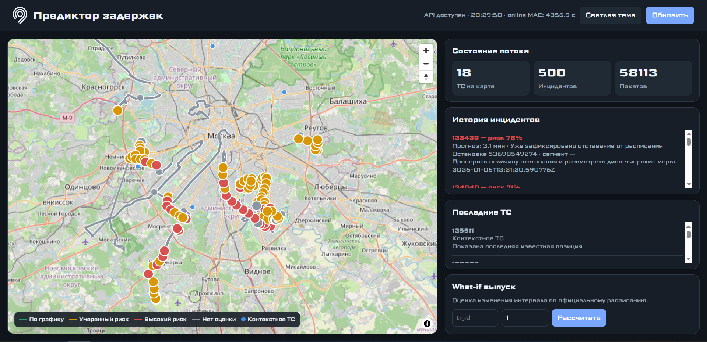
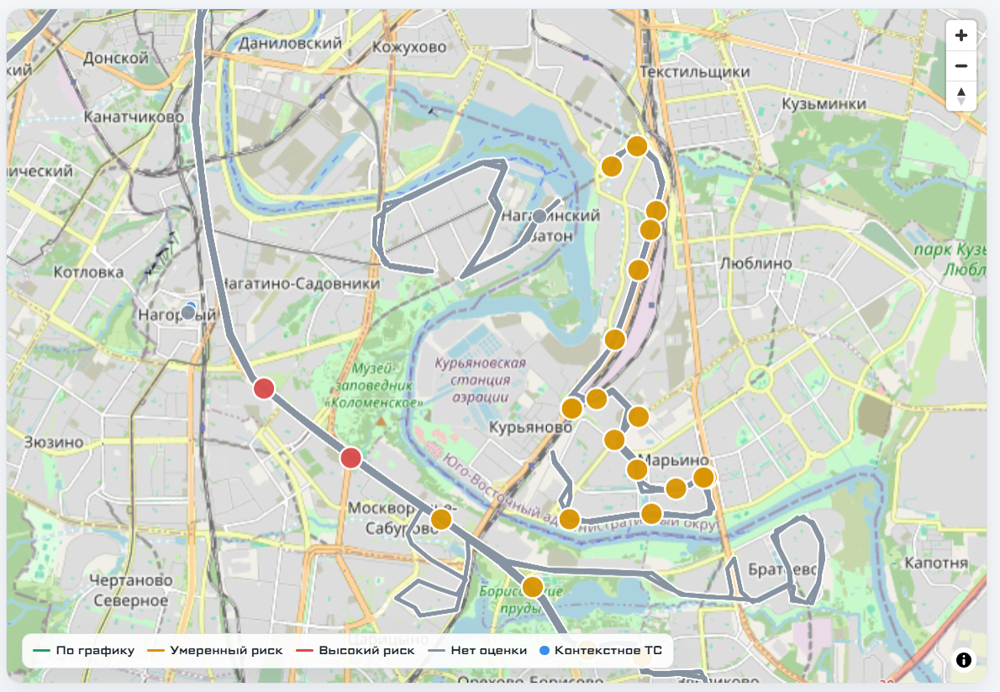
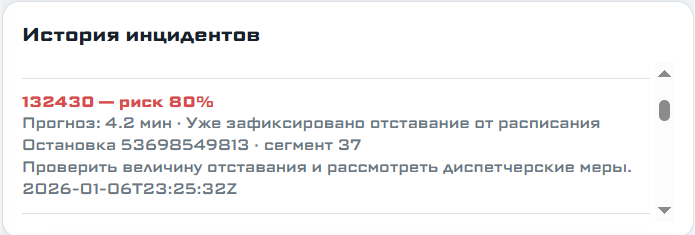
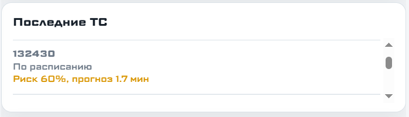
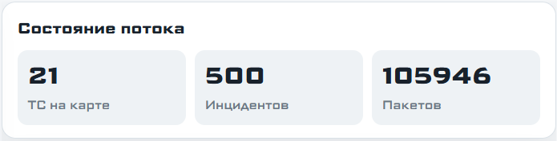
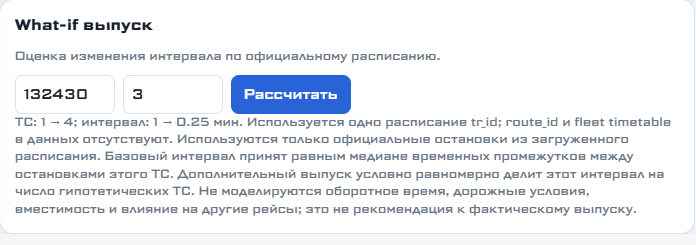

# Дашборд «Предиктор задержек»

## Карта

Дашборд использует локально размещённую библиотеку MapLibre GL JS 5.6.2 с
GeoJSON-слоями официальных маршрутов и текущих позиций ТС. Библиотека и стили
отдаются самим backend, поэтому загрузка карты не зависит от CDN. Фон карты
загружается из растровых тайлов OpenStreetMap; для фоновых тайлов браузеру всё
ещё необходим доступ в интернет. API-ключ не требуется.

```powershell
docker compose up -d --build
```

После запуска открыть `http://localhost:8000/`.


Если тайлы OpenStreetMap недоступны, локальная библиотека и интерфейс остаются
загруженными, однако фон карты может быть пустым.

## Элементы интерфейса

- верхняя панель показывает состояние API и содержит обновление данных;
- карта показывает официальные маршруты, scheduled-транспорт и контекстные ТС;
- зелёный, жёлтый, красный и серый цвета соответствуют уровням риска;
- панель метрик показывает число ТС, инцидентов и принятых пакетов;
- история инцидентов содержит прогноз, риск, остановку и наблюдаемую причину;
- список ТС позволяет быстро увидеть состояние отдельных машин;
- блок What-if оценивает изменение интервала при добавлении условного выпуска;
- переключатель темы меняет светлое и тёмное оформление.

Переключатель темы позволяет работать со светлым и тёмным оформлением интерфейса.



Маршруты и позиции транспортных средств отображаются отдельными слоями карты, что позволяет различать плановое движение и текущую ситуацию.



В истории инцидентов собраны предупреждения с прогнозом, уровнем риска и связанной остановкой.



Список транспортных средств помогает быстро открыть состояние конкретного объекта.



Панель «Состояние потока» показывает сводную информацию о поступлении и обработке телеметрии.



Блок What-if предназначен для оценки сценария с дополнительным выпуском транспорта.



## Что изменено

- уменьшена ширина карты, история инцидентов и список ТС получили отдельные
  прокручиваемые области;
- добавлены светлая и тёмная темы с сохранением выбора в браузере;
- название интерфейса: «Предиктор задержек»;
- добавлен транспортный SVG-знак слева от названия;
- основной шрифт интерфейса — Science Gothic;
- маршруты и ТС отображаются отдельными GeoJSON-слоями MapLibre;
- последняя известная позиция ТС с невалидным GPS помечается как устаревшая,
  но остаётся видимой на карте.
