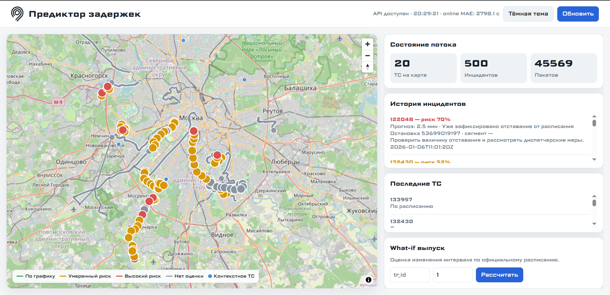

# Запуск проекта

## Назначение

Проект запускает демонстрационный контур предиктора изменений в графике
наземного транспорта:

```text
телеметрия → Backend → ML-ядро → прогноз и риск → диспетчерский дашборд
```

Основной способ запуска — Docker Compose. README в корне репозитория является
главной точкой входа; этот документ содержит расширенную пошаговую инструкцию.

## Требования

- Docker Engine;
- Docker Compose v2;
- PowerShell или любой HTTP-клиент;
- браузер для открытия дашборда;
- доступ браузера к тайлам OpenStreetMap для фоновой карты.

## Запуск сервисов

Из корня проекта выполните:

```powershell
docker compose up -d --build
```

В Compose запускаются:

| Сервис | Назначение | Адрес |
|---|---|---|
| `backend` | поток, расписание, прогнозы, инциденты и UI | `http://localhost:8000` |
| `ml` | обучение, инференс и ML health | `http://localhost:8001` |
| NDTP listener | приём TCP-телеметрии | `localhost:9201` |

Проверка:

```powershell
Invoke-RestMethod http://localhost:8000/health
Invoke-RestMethod http://localhost:8001/health
docker compose ps
```

В поле `status` сервисов отображается готовность расписания и ML-модели.
Состояние `degraded` используется для прозрачного отображения режима
fallback; Backend продолжает принимать запросы и возвращает диагностическую
информацию в ответе.

Открыть программу:

```text
http://localhost:8000/
```



## Обучение модели

Штатное обучение по causal join выполняется через ML API:

```powershell
Invoke-RestMethod -Method Post http://localhost:8001/train/dataset
```

Проверить опубликованную модель:

```powershell
Invoke-RestMethod http://localhost:8001/health
```

Обучение выполняется вне event loop, а новая версия артефакта публикуется
атомарно. Во время обучения предыдущий рабочий snapshot продолжает
обслуживать запросы.

## Остановка

```powershell
docker compose down
```

Логи:

```powershell
docker compose logs -f backend
docker compose logs -f ml
```

## Быстрая проверка кода

```powershell
python -m unittest discover -s tests -v
python -m compileall -q backend ml_service transit_common scripts
node --check dashboard\app.js
```

## Ссылки после запуска

```powershell
http://localhost:8000/
http://localhost:8000/docs
http://localhost:8001/docs
http://localhost:8000/health
http://localhost:8001/health
```